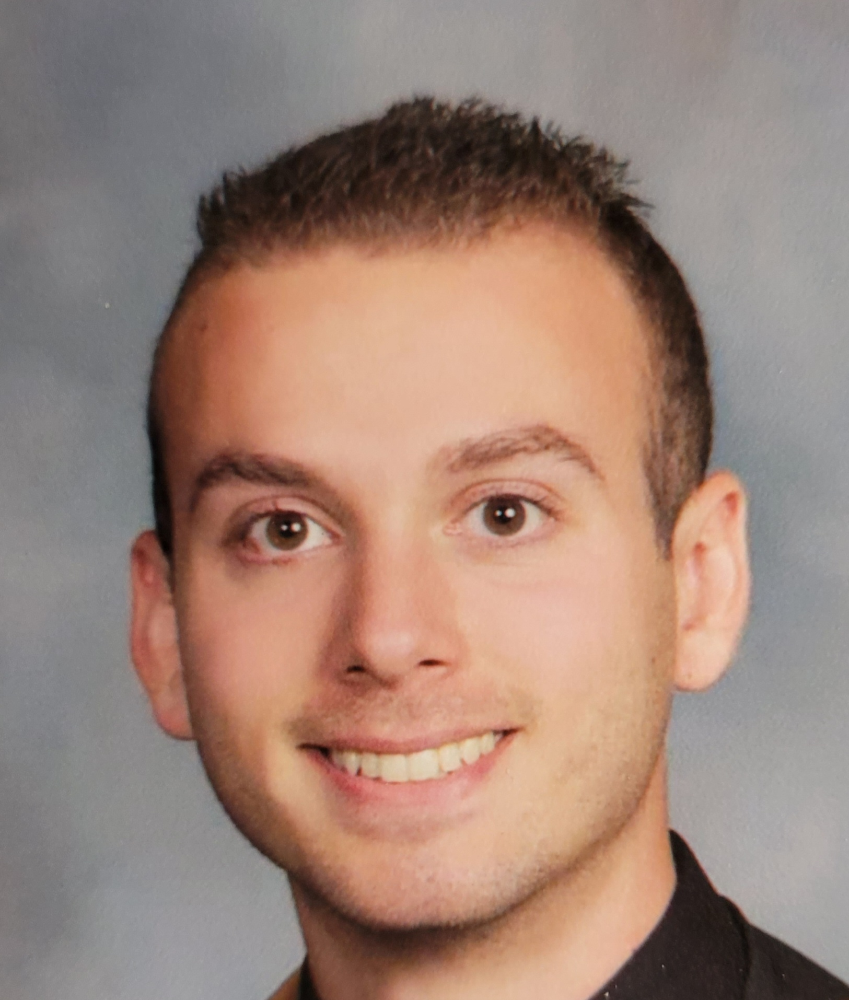

# Jeremy Segarra

## Introduction Assignment

Hello Professor Plotkin,

I did my undergraduate at The Culinary Institute of America and began my career as a professional chef in 2015. Cooking has been a long-time passion for me passed down from my grandparents who were from Italy. I decided to make a career change after covid happened. The restaurant industry has taken a bad hit, so I decided to try programming and have come to really enjoy it. I’ve always had an interest in creating and learning new things, for instance I built my own computer for gaming. In the graduate program I have taken Data Structures, Advanced Data Structures & Algorithms, Data Science, Database Design/Database Management, Computer Systems and Cyber Security. As for projects, I have done a data science group project that predicted weather patterns in temperature using Hadoop and Naïve Bayes algorithm as well as designed and implemented a database for a video game store. Another project from advanced data structures was on the implementation of splay trees and many more.

This course I am particularly excited for because I have chosen Web Development as my focused path for a career afterwards. I enjoy being able to see what I can build, not just the functionality but also design. Currently, I am also taking Udemy courses on Vue and Node.js and have done small projects already to better my understanding of Web Development. With so much to learn I do a lot of self-studies outside of school. I hope through this class, and my independent study I will not only be able to find a job but also try some freelance work developing websites. My hope for this course is that I can make a really nice project and future projects to keep improving and reach my goal of becoming a professional Full stack Developer.
